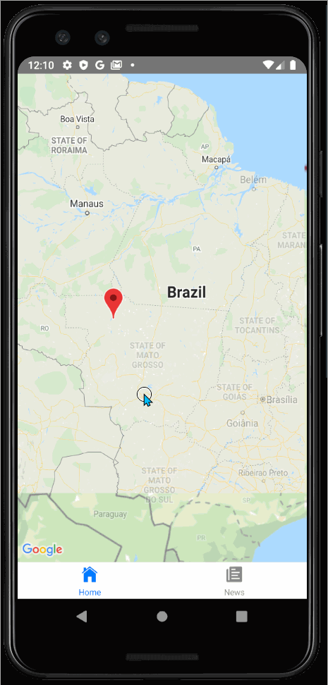

<h1 align="center">
  NewsApp
</h1>

<p align="center">An app that let's you read news from countries using the News API and Google Maps Platform!</p>

### Table of Contents
  * [Installation and usage](#installation)
  * [Screenshots](#screenshot)
  * [Libraries](#libraries)
  * [Legal](#legal)

## <a name="installation"></a> Installation and usage

For installing this project on your machine just clone the project and run in the console: 
```console
$ yarn install
```
or
```console
$ npm install
```
Make sure you have [npm](https://nodejs.org/en/) installed. Once is done installing dependencies, run:
```console
$ npx react-native run-android
```
or
```console
$ npx react-native run-ios
```

## <a name="screenshot"></a> Screenshots

<p align="center">
   
   
</p>

## <a name="libraries"></a> Libraries
  * [react-navigation](https://github.com/react-navigation/react-navigation)
  * [react-native-webview](https://github.com/react-native-community/react-native-webview)
  * [axios](https://github.com/qiangmao/axios)
  * [react-native-maps](https://github.com/react-native-community/react-native-maps)
  * [react-native-dotenv](https://github.com/zetachang/react-native-dotenv)
  * [react-native-vector-icons](https://github.com/oblador/react-native-vector-icons)
  * [News API](https://newsapi.org/docs/get-started)
  * [Google Maps Platform](https://developers.google.com/maps/documentation)

## <a name="legal"> </a> Legal

This project was created only for testing purposes and it has no relationship with any website shown in this app.
